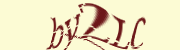
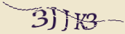
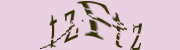
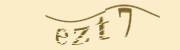

# Captcha integration for Laravel

[](https://packagist.org/packages/bonecms/laravel-captcha)
[](https://packagist.org/packages/bonecms/laravel-captcha)
[](https://packagist.org/packages/bonecms/laravel-captcha)












## Installing Laravel Captcha Composer Package
Note: If you do not have Composer yet, you can install it by following the instructions on https://getcomposer.org

#### Step 1. Install package
```bash
composer require bonecms/laravel-captcha
```

| Captcha | Laravel |
|---|---|
| [v2.2](https://github.com/igoshev/laravel-captcha/tree/2.2)  | 5.5 - 9.x |
| [v2.1](https://github.com/igoshev/laravel-captcha/tree/2.1) | 5.4  |
| [v1.1](https://github.com/igoshev/laravel-captcha/tree/1.1) | 5.3 and below |


#### Step 2 for Laravel 5.5 and below. Register the Laravel Captcha service provider
{LARAVEL_ROOT}/config/app.php:
```php
'providers' => [
    ...
    Igoshev\Captcha\Providers\CaptchaServiceProvider::class,
],
```

## Using Laravel Captcha
Generate a Captcha markup in your Controller:
```php
<?php 

namespace App\Http\Controllers;

use App\Http\Controllers\Controller;

class MyController extends Controller 
{
    public function getExample() 
    {
        return view('myView');
    }

}
```
Showing a Captcha in a View:
```html
...
@captcha
<input type="text" id="captcha" name="captcha" autocomplete="off">
 ...
```
Check user input during form submission:
```php
<?php 

namespace App\Http\Controllers;

use App\Http\Controllers\Controller;
use Illuminate\Http\Request;

class MyController extends Controller 
{
    public function getExample() 
    {
        return view('myView');
    }

    public function postExample(Request $request)
    {
    	$this->validate($request, [
            'captcha' => 'required|captcha'
        ]);

        // Validation passed
    }
}
```
### Configuration
```bash
php artisan vendor:publish --tag=bone-captcha-config
```
```php
<?php

return [

/*
    |--------------------------------------------------------------------------
    | Captcha middleware
    |--------------------------------------------------------------------------
    |
    */
    'middleware' => ['web'],

    /*
    |--------------------------------------------------------------------------
    | Captcha routes
    |--------------------------------------------------------------------------
    |
    */
    'routes' => [
        'image'     => 'captcha/image',
        'image_tag' => 'captcha/image_tag'
    ],

    /*
    |--------------------------------------------------------------------------
    | Blade directive
    |--------------------------------------------------------------------------
    | You can use blade directive @captcha for rendering captcha.
    |
    */
    'blade' => 'captcha',

    /*
    |--------------------------------------------------------------------------
    | Validator name
    |--------------------------------------------------------------------------
    |
    */
    'validator' => 'captcha',

    /*
    |--------------------------------------------------------------------------
    | Captcha generator.
    |--------------------------------------------------------------------------
    | Must implement GeneratorInterface.
    |
    */
    'generator' => \Igoshev\Captcha\Captcha\Generator\GeneratorWaves::class,

    /*
    |--------------------------------------------------------------------------
    | Storage code.
    |--------------------------------------------------------------------------
    | Must implement StorageInterface.
    |
    */
    'storage' => \Igoshev\Captcha\Captcha\Storage\SessionStorage::class,

    /*
    |--------------------------------------------------------------------------
    | Code generator.
    |--------------------------------------------------------------------------
    | Must implement CodeInterface.
    |
    */
    'code' => \Igoshev\Captcha\Captcha\Code\SimpleCode::class,

    /*
    |--------------------------------------------------------------------------
    | Font
    |--------------------------------------------------------------------------
    | Supported: "IndiraK".
    |
    */
    'font' => base_path('vendor/bonecms/laravel-captcha/src/resources/fonts/IndiraK.ttf'),

    /*
    |--------------------------------------------------------------------------
    | Font size
    |--------------------------------------------------------------------------
    | Font size in pixels.
    |
    */
    'fontSize' => 26,

    /*
    |--------------------------------------------------------------------------
    | Letter spacing
    |--------------------------------------------------------------------------
    | Spacing between letters in pixels.
    |
    */
    'letterSpacing' => 2,

    /*
    |--------------------------------------------------------------------------
    | Code Length
    |--------------------------------------------------------------------------
    | You can specify an array or integer.
    |
    */
    'length' => [4, 5],

    /*
    |--------------------------------------------------------------------------
    | Displayed chars
    |--------------------------------------------------------------------------
    | Enter the different characters.
    |
    */
    'chars' => 'QSFHTRPAJKLMZXCVBNabdefhxktyzj23456789',

    /*
    |--------------------------------------------------------------------------
    | Image Size
    |--------------------------------------------------------------------------
    | Captcha image size can be controlled by setting the width
    | and height properties.
    |
    |
    */
    'width'  => 180,
    'height' => 50,

    /*
    |--------------------------------------------------------------------------
    | Background Captcha
    |--------------------------------------------------------------------------
    | You can specify an array or string.
    |
    */
    'background' => 'f2f2f2',

    /*
    |--------------------------------------------------------------------------
    | Colors characters
    |--------------------------------------------------------------------------
    | You can specify an array or string.
    |
    */
    'colors' => '2980b9',

    /*
    |--------------------------------------------------------------------------
    | Scratches
    |--------------------------------------------------------------------------
    | The number of scratches displayed in the Captcha.
    |
    */
    'scratches' => [1, 6],

    /*
    |--------------------------------------------------------------------------
    | Id of the Captcha code input textbox
    |--------------------------------------------------------------------------
    | After updating the Captcha focus will be set on an element with this id.
    |
    */
    'inputId' => 'captcha',
    
];
```
### Localization
Supported languages (17): 
* Arabic
* Chinese
* Dutch
* English
* French
* German
* Hindi
* Indonesian
* Italian
* Japanese
* Korean
* Persian
* Portuguese
* Russian
* Spanish
* Turkish
* Ukrainian
```bash
php artisan vendor:publish --tag=bone-captcha-lang
```

### View
```bash
php artisan vendor:publish --tag=bone-captcha-views
```

## Donation
If this project help you reduce time to develop, you can give me a cup of coffee :)

[](https://paypal.me/dmigoshev)
